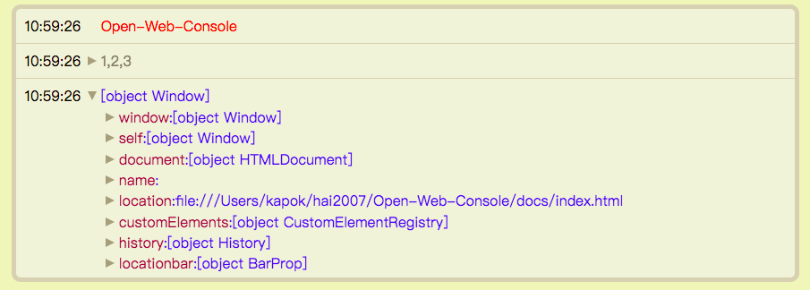

# [Open-Web-Console](https://hai2007.github.io/Open-Web-Console)
一个类似浏览器控制台Console的插件，可以实现在页面中进行打印。

  
  
  
  

## Issues
使用的时候遇到任何问题或有好的建议，请点击进入[issue](https://github.com/hai2007/Open-Web-Console/issues)！

## How to use?

具体的使用你可以[查阅文档](https://hai2007.github.io/Open-Web-Console)哦~

开源协议
---------------------------------------
[MIT](https://github.com/hai2007/Open-Web-Console/blob/master/LICENSE)

Copyright (c) 2021 [hai2007](https://hai2007.gitee.io/sweethome/) 走一步，再走一步。
